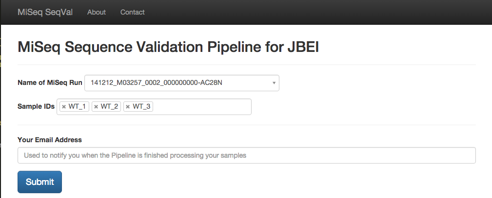
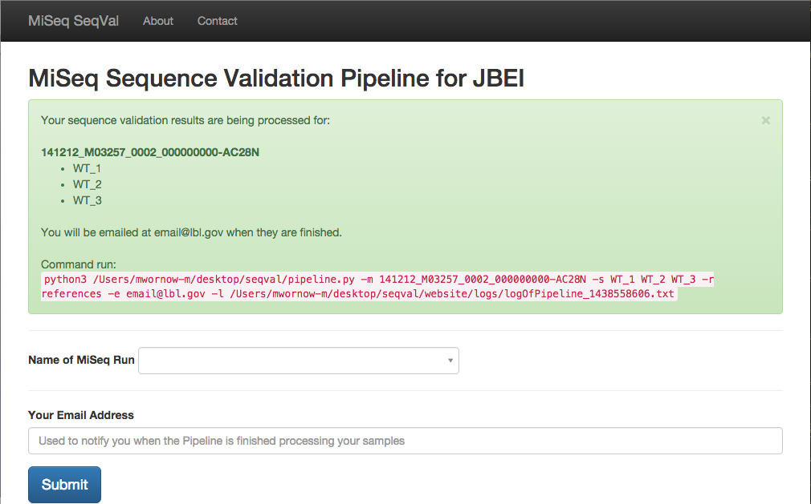
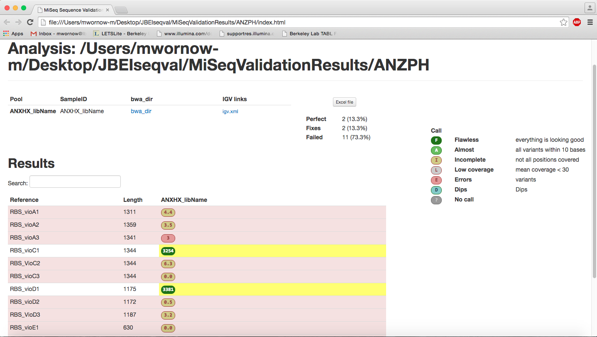
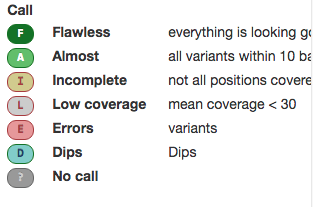
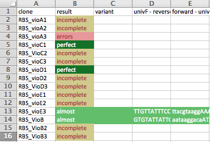
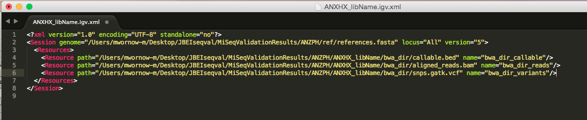

Sequence Validation Pipeline

# Screenshots of Output

## Website Interface 
### Before Request Submission

### After Submission

## HTML page displaying each SubLibrary's call

## Types of calls

## Excel sheet displaying each SubLibrary's information

## IGV XML to view results in IGV

##Actual IGV File


# Installation

1. Download the entire repo (The Test_Scripts and MiSeqValidationResults folder are unnecessary)
2. Install all the dependencies listed below
3. Set paths in:
    * pipeline.py => Set first 2 "System-Defined Variables"; Rest will be automatically set
    * PostProcessing/scripts/postanalysis/genedesign.py => Set pathToPipeline="path/To/pipeline"
    * website/seqval.py => Set pathToPipeline="path/To/pipeline" in function `run_pipeline()`
4. Add JBEI SMB credentials to:
    * MiSeqServerData.py => Everywhere there is the word 'secret'
    * website/seqval.py => Everywhere there is the word 'secret'
4. Run it!


## Website interface
The website wil automatically be active at 127.0.0.1:82 To get the website interface running, run:

```
python seqval.py
```


## Command line
Pipeline.py is a Python 3 script, so call it with Python 3


```
python3 pipeline.py -m <Main Library name> -s <Sub Library Names> -r <Reference sequence name> -e <Email address> -l <Path to logfile.txt> -n <Boolean, to use NERSC Version of tools>
```

* -m Main Library Name
	* Name of Folder on MiSeq where this run is stored
	* Example: `-m 141212_M03257_0002_000000000-AC28N`
* -s Sub Library Names
	* Space separated list of sample IDs that we want validated. These must be located in the Main Library folder
	* Example: `-s WT_1 WT_2 WT_3 32_1`
* -e Email Address
	* Pipeline will send email to this address when Pipeline is finished
	* Example: `-e email@lbl.gov`
* -l Path to logfile.txt
	* Path to where a Log File will be written after Pipeline is finished, detailing execution information
	* Example: `-l /Users/synbio/sequencevalidation/logs`
* -n Boolean flag for using NERSC version of tools
    * If set, use the (older) NERSC Versions of the BWA, Samtools, and Picard tools
    * Example: `-n`

###Requirements:
* Tools Folder (included with repo)
    * GATK - 3.4-46
    * BWA - 0.7.12
    * Picard - 1.134
    * Samtools - 1.12
    * FastQC - 0.11.3
    * DNAssemble - Perl Module
    * BioDesign - Perl Module
    * Post-Processing - Python Scripts
    * MiSeq BAM Generation Tools - Perl Scripts
* Perl modules (Perl 5.18)
    * Modern::Perl
    	* `sudo cpan install Modern::Perl`
    * Getup::Long
    	* `sudo cpan install Getup::Long`
    * Data::Alias
    	* `sudo cpan install Data::Alias`
    * Filename::Basename
    	* `sudo cpan install Filename::Basename`
    * Pod::Usage
    	* `sudo cpan install Pod::Usage`
	* List::MoreUtils
    	* `sudo cpan install List::MoreUtils`
    * YAML::Syck
    	* `sudo cpan install YAML::Syck`
    * Log::Log4perl
    	* `sudo cpan install Log::Log4perl`
    * File::NFSLock
    	* `sudo cpan install File::NFSLock`

* Python
    * lxml
    	* `pip install lxml`
    * scipy
    	* `pip install scipy`
    * numpy
    	* `pip install numpy`
    * openpyxl
    	* `pip install openpyxl`
    * biopython
    	* `pip install biopython`
    * pysmb
    	* `pip3 install pysmb`
    * flask (Only needed for Website)
    	* `pip install flask`

Note: Everything listed with just `pip` is installed for Python 2.7, since PostProcessing's scripts and Flask depend on Python 2.7.

* Other OS packages:
	* zlib
		* `sudo apt-get install zlib`
	* curses
		* `sudo apt-get install libncurses5-dev`
	* pigz
		* `sudo apt-get install pigz`
	* Java Runtime Environment
		* `sudo apt-get install default-jre`


# The process:

1. Take MiSeq files from the SMB server
2. Create .bam files
3. Use GATK to generate coverage depth, .vcf, .bed, and call_summary.txt
4. Make calls and generate summary: IGV.xml, Excel, and HTML 

Utilizes modified versions of Joel's and Ernst's Perl and Python scripts, respectively.

See **Presentation/Presentation.pptx** for more!
